Hardware for Spectrum Analyzer with Raspberry Pi Pico
=====================================================

I bought some RGB LED matrix pretty long ago. It looks like this:

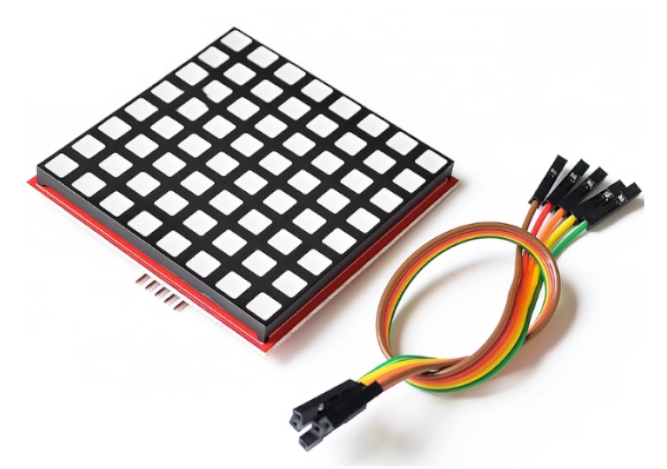

According to the seller, this is an 8x8 RGB LED matrix driven by 74HC595, and has SPI support.
The module provide 5 pins: VCC, GND, CLK, MOSI, and CS, which is the standard SPI interface.
The seller provided a sample program for Raspberry Pi:


```c
#include <stdio.h>
#include <wiringPi.h>
#include <wiringPiSPI.h>
#include <stdint.h>
 
#define RED_DATA 0
#define BLUE_DATA 1
#define GREEN_DATA 2
 
int main(void)
{
  static uint8_t data[4] = {0x0,0x0,0x0,0x0};
  wiringPiSetup();
  wiringPiSPISetup(0,500000);
  while(1)
  {
    static uint8_t heart[8] = {0x00, 0x66, 0xFF, 0xFF, 0xFF, 0x7E, 0x3C, 0x18};
    int j;
    int x=2;
    for ( j=0;j<8;j++)
    {
      data[0] = ~heart[j];
      data[2] = 0xFF;
      data[1] = 0xFF;
      data[3] = 0x01 << j ;
      wiringPiSPIDataRW(0,data,sizeof(data));
      delay(x);
    };
  };
}
```

According to the code, I assume the data should be sent in the following format:

```
row0: [0xRR 0xBB 0xGG 0b00000001]
row1: [0xRR 0xBB 0xGG 0b00000010]
row2: [0xRR 0xBB 0xGG 0b00000100]
row3: [0xRR 0xBB 0xGG 0b00001000]
row4: [0xRR 0xBB 0xGG 0b00010000]
row5: [0xRR 0xBB 0xGG 0b00100000]
row6: [0xRR 0xBB 0xGG 0b01000000]
row7: [0xRR 0xBB 0xGG 0b10000000]
```

where `0xRR` is the red data, `0xBB` is the blue data, `0xGG` is the green data.
Each byte represents one row, and the 4th byte indicates which row these bytes are for.


So my first step is to write a program to drive the LED matrix. I used Raspberry Pi Pico and CircuitPython for this project. After some try and error, I successfully lighted up the LED matrix.

Unfortunately, after some exploration, I noticed that there was a flaw in the LED matrix: the red, blue, and green LED in one pixel share the same resistor. Since red LED has lower voltage drop than blue and green LED, the red LED will take most of the current and the blue and green LED will be very dim, if the bytes for R, G, B are sent simultaneously. This means you won't be able to show colors other than Red, Green, and Blue.

In order to display other colors, I have to use the scanning trick: send one color one time and set other two colors to `0x00`, then send the second color and set other two colors to `0x00`, and so on. This way, only one color will be lit at one time, so red, gree, and blue LED will have the same brightness.

It's not easy to achieve this with CircuitPython bitbanging, since you have to send the data fast enough to prevent blinking, and CircuitPython is just not fast enough. I have to employ the PIO feature to achieve this. I wrote a PIO program to drive the LED matrix, and it works pretty well:


```
    .program quad_led_matrix_spi
    .side_set 1

    set pins, 0x7
    set x, 31
loop1:
    out pins, 1       side 0
    jmp x--, loop1    side 1
    
    set pins, 0xb
    set x, 31
loop2:
    out pins, 1       side 0
    jmp x--, loop2    side 1

    set pins, 0xd
    set x, 31
loop3:
    out pins, 1       side 0
    jmp x--, loop3    side 1

    set pins, 0xe
    set x, 31
loop4:
    out pins, 1       side 0
    jmp x--, loop4    side 1
```

This PIO assembly uses `set` pin for `CS`, `sideset` for `CLK`, and `out` pins for `MOSI`.
It simply reads the data from input buffer and send it to 4 LED matrix, one by one, controlled by `x` register. Then, use CircuitPython to arrange the data and send it to the input buffer of the PIO program. The PIO program will send the data to the LED matrix.

With [this program](../rp2040/pixelmatrix.py), I can display any color I want. Here is a picture of all pixels showing white:

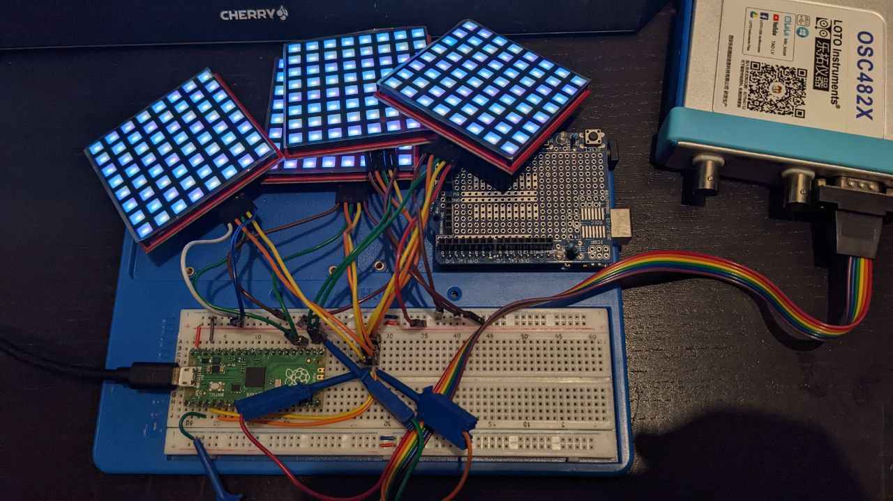

I also 3D printed a frame to hold 4 screens together:

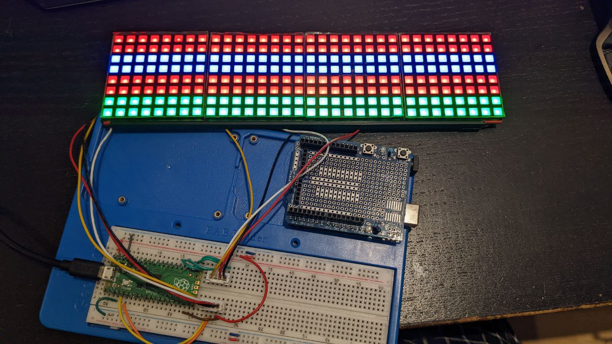

In order to make a spectrum analyzer, I need to capture the input audio signal and send it to the ADC pin of the Raspberry Pi Pico. I need an amplifier circuit to receive the audio signal, and then use an OP Amp to scale it to the range of 0-3.3V. I ended up with the following schematic:

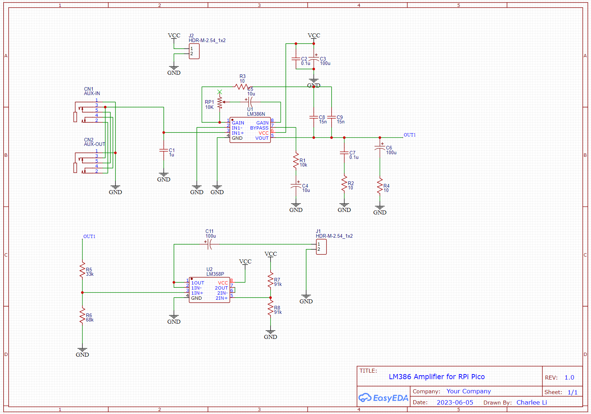

The upper part uses LM386 to amplify the audio signal to the range of 0-5V. RP1 is used to adjust the gain. The lower part uses OP Amp to scale the signal to the range of 0-3.3V, so that it can be safely picked up by RPi Pico.

Here is the breadboard:

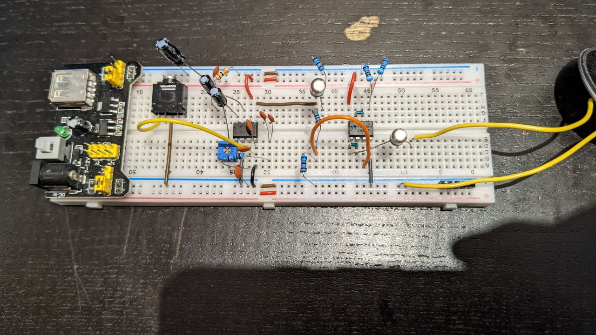

And here is the PCB:

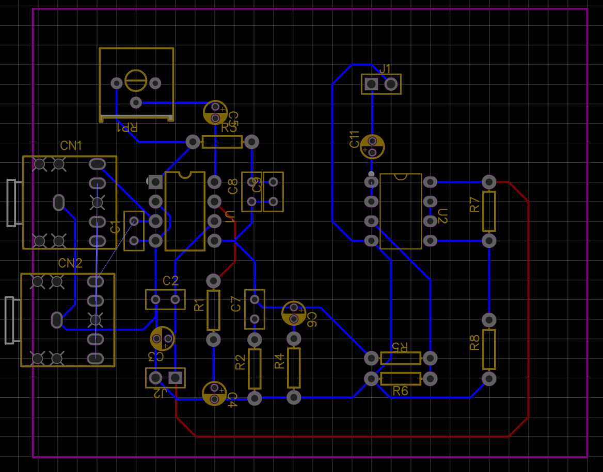

The soldered PCB looks like this:

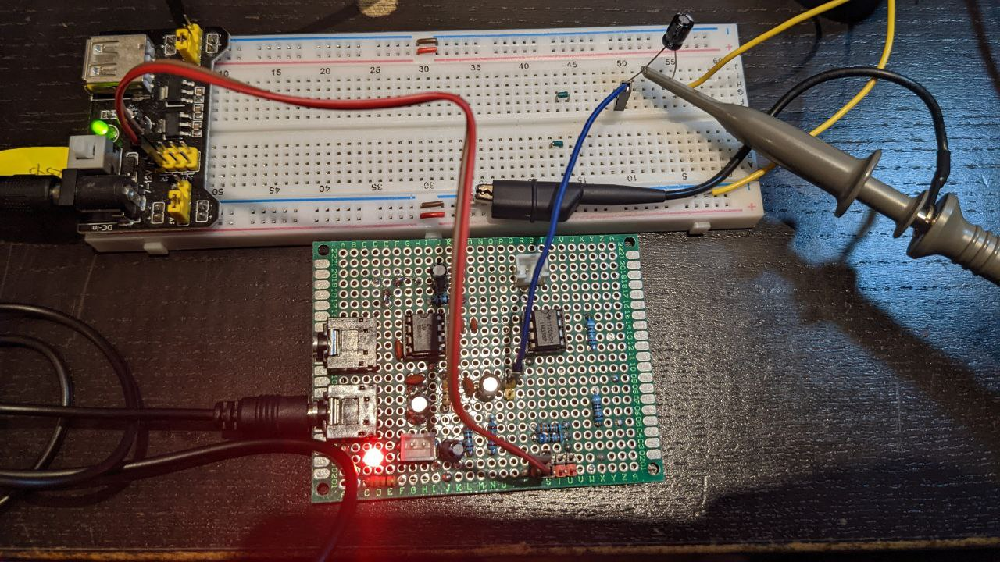

Now it's time to make the spectrum analyzer. A spectrum analyzer is simply a FFT (Fast Fourier Transform) of the audio signal. I used the [FFT library from ulab](https://micropython-ulab.readthedocs.io/en/latest/numpy-fft.html). The code can be found [here](../rp2040/code.py).

To make it more useful, I also embedded a DS1302 RTC module to display the current time.
Note that Raspberry Pi Pico does not have a RTC module, so you cannot read the current time using `datetime` package, when the Pico is not connected to a computer. I have to use a DS1302 RTC module with a CR2032 battery to keep the time.

The [DS1302 library](https://github.com/odeevee/DS1302_CircuitPython) has a bug that it does not set the year correctly, so I have to manually fix the bug and include [the source code](../rp2040/lib/ds1302.py) in the lib directory.

Here is a picture of all components connected together:

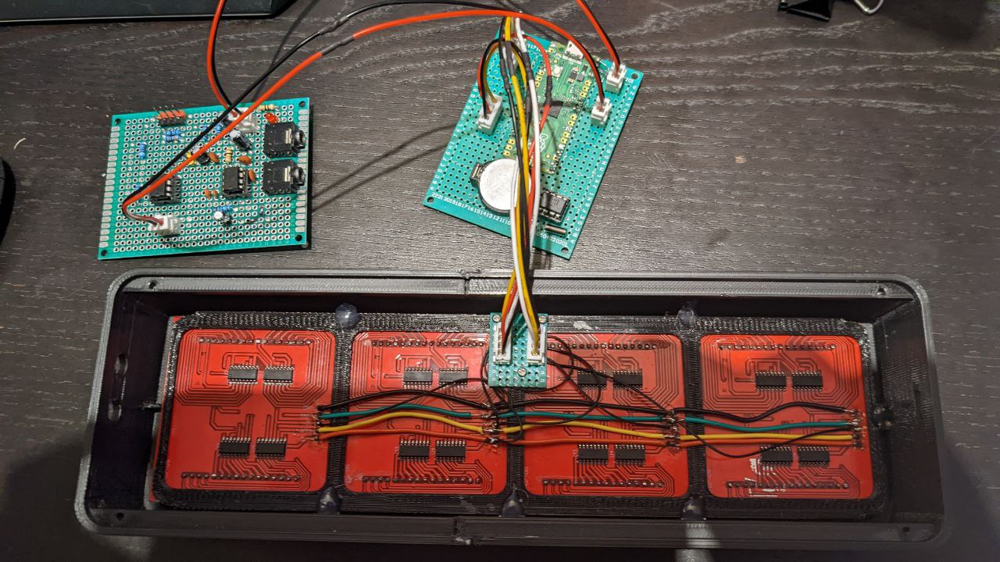

I printed a back cover to hold the RPi Pico and the amplifier:

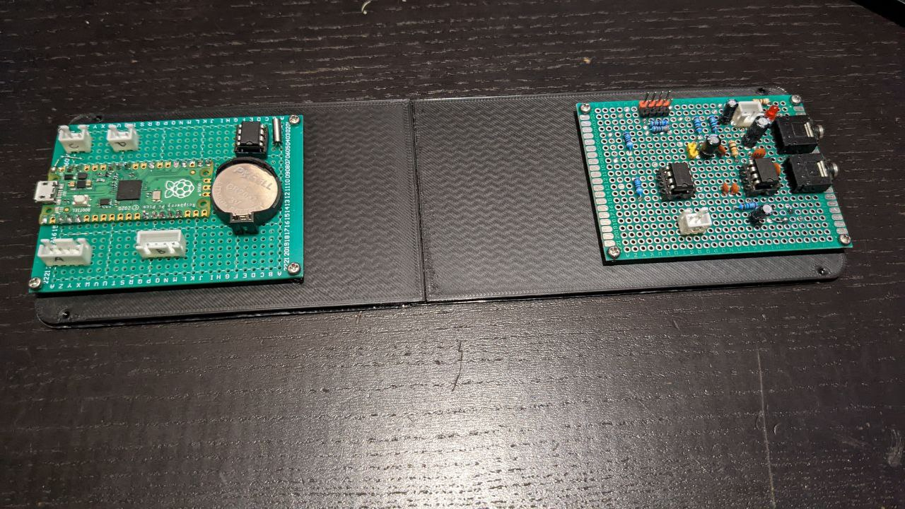

And a case to hold the screen:

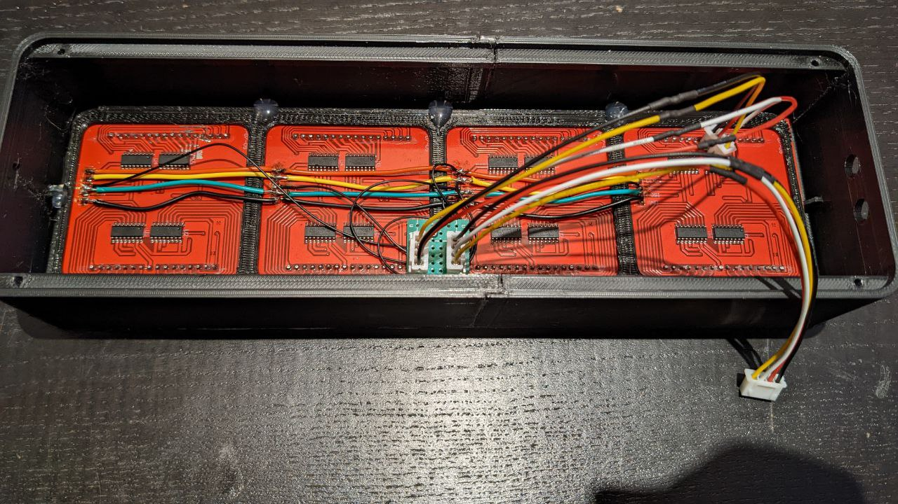

Case and back cover together:

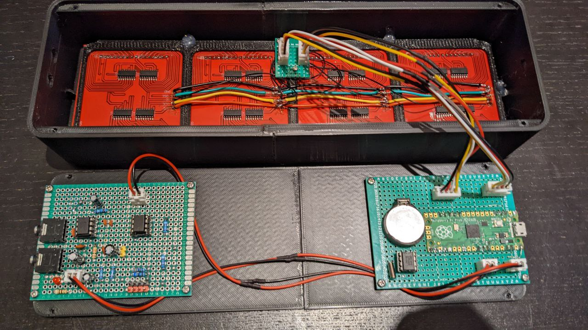

Finally, glue a piece of black acrylic to the front of the case:

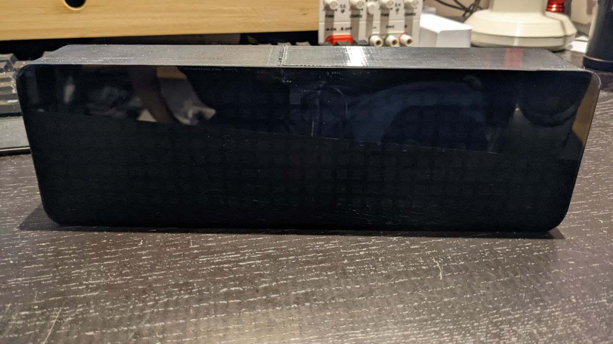

When no signal input, it will display the current time:

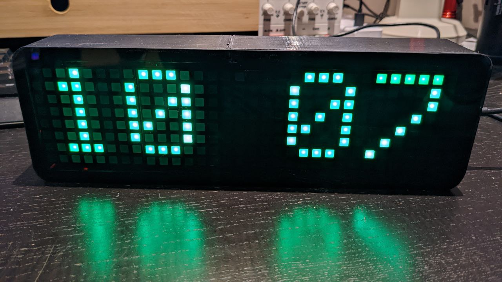

When there is signal input, it will display the spectrum:

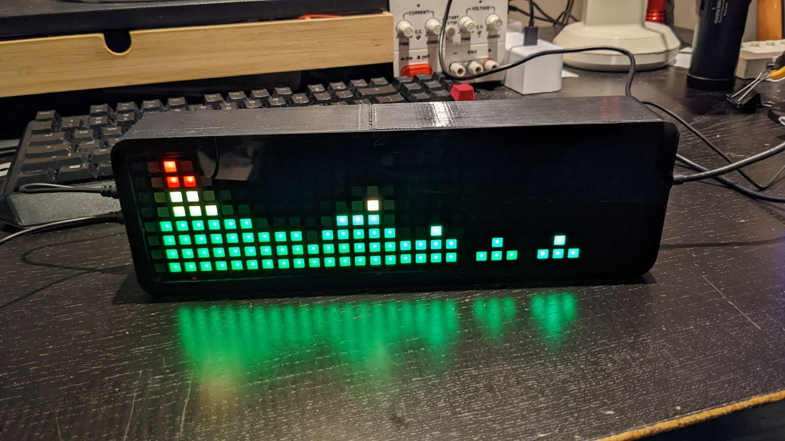


